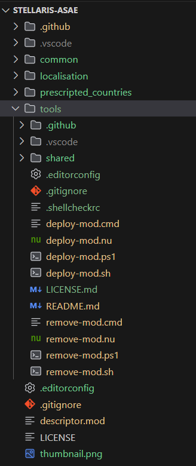
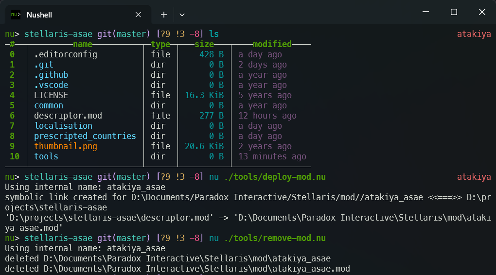

# Stellaris Mod Deploy Tools

A set of tools to help with mod development for Stellaris.  
Currently this is a set of scripts to help with mod deployment, such as symlinking the project to the Stellaris mod directory, as well as copying the &lt;modname&gt;.mod file.  
Maybe more in the future.

## Basic Usage
1. Copy the entire directory into your Stellaris mods directory, such as `<mod-directory>/tools/`  
_Optionally, you can delete any scripts you don't require_  

	

Example Directory Structure Image

	
	
  

1. Run the tools from the root of your mod project, where the `descriptor.mod` file is located.
	
_Example of the `deploy-mod.nu` script in action with nushell_

## License
Licensed under the MIT License.  
See [LICENSE.md](LICENSE.md) for details.
